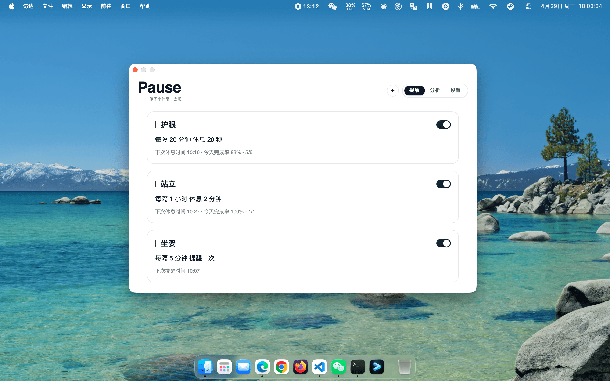
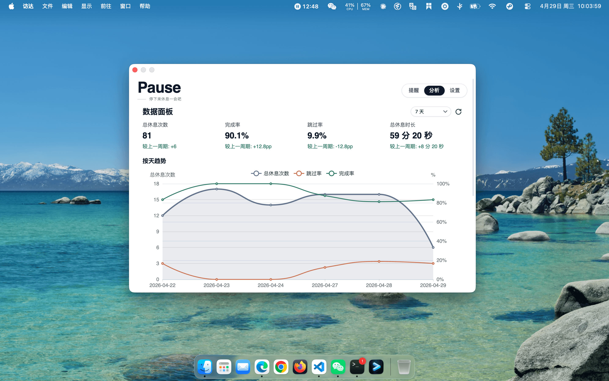
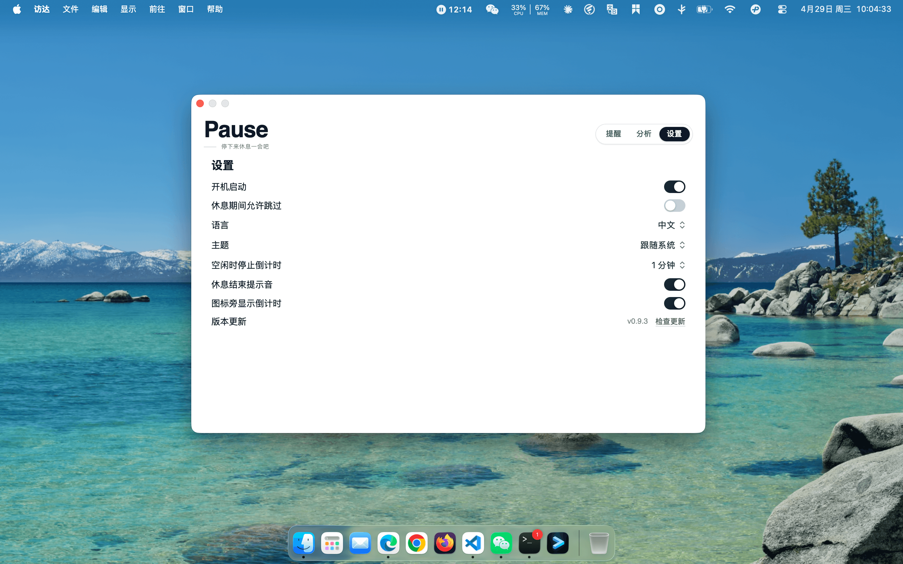

# Pause

Pause 是一个跨平台休息提醒应用（macOS / Windows / Linux）。

## 功能

- 定时休息提醒，可自定义间隔与时长
- 全屏休息遮罩，支持强制模式（不可跳过/延迟）
- 休息数据统计与趋势分析
- 声音提示
- 开机自启动
- 中文 / English 双语
- macOS / Windows / Linux 跨平台

## 应用预览

| 主界面 — 提醒 | 主界面 — 分析 | 主界面 — 设置 | 休息遮罩 |
|:---:|:---:|:---:|:---:|
|  |  |  |  |

https://github.com/user-attachments/assets/3ac20ceb-b286-4bf2-ad21-6a534e1dcf9a

## 下载安装

前往 [GitHub Releases](https://github.com/Dnsayhey/pause/releases/latest) 下载对应平台的安装包：

| 平台 | 文件 |
|---|---|
| macOS | `.dmg` |
| Windows | `.exe` 安装器 |
| Linux | 适配层可用，桌面体验持续补齐中 |

## 技术栈

- **后端** — Go + [Wails v2](https://wails.io/)
- **前端** — React 18 + TypeScript + Vite + Tailwind CSS v4
- **存储** — SQLite（[modernc.org/sqlite](https://pkg.go.dev/modernc.org/sqlite)）+ JSON 配置文件
- **图表** — [ECharts](https://echarts.apache.org/)

## 文档索引

- [文档总索引](./docs/README.md)
- [架构与代码结构](./docs/architecture.md)
- [打包、发版与更新源](./docs/packaging.md)
- [通知能力与前端策略](./docs/notification-logic.md)

## 开发环境

- Go `1.24+`
- Node.js + npm（用于 frontend 构建）

## 本地开发

### 1) 安装前端依赖

```bash
npm --prefix frontend install
```

### 2) 构建前端资源

```bash
npm --prefix frontend run build
```

### 3) 运行桌面版（Wails）

```bash
go run -tags wails,dev .
```

说明：

- 本地 `dev` 构建默认禁用通知相关能力，避免开发态和正式打包态的系统行为差异影响主界面调试。
- 真实通知行为请在打包版中验证。
- 如需显式强制关闭通知能力，也可以设置：

  ```bash
  PAUSE_DISABLE_NOTIFICATION_CAPABILITY=1 go run -tags wails,dev .
  ```

### 4) 运行无 UI 后端循环

```bash
go run .
```

### 5) 运行测试

```bash
go test ./...
go test -tags wails ./...
```

## 版本管理

版本号单一来源：`VERSION`

```bash
# 校验版本一致性
./scripts/check-version-sync.sh

# 更新版本（同步 VERSION / wails.json / frontend package.json）
./scripts/bump-version.sh <new_version>
```

## 打包与发布

完整规范见：[docs/packaging.md](./docs/packaging.md)

```bash
# macOS DMG
./scripts/build-dmg.sh

# Windows 安装器
./scripts/build-windows-installer.sh

# 生成发布清单与校验和
./scripts/generate-release-manifest.sh --version <version> --channel stable
```

会同时输出：

- `release-manifest.txt`
- `SHA256SUMS`
- `updates.json`（供客户端“检查更新”消费）

桌面端前端构建时需要注入稳定更新源：

```bash
VITE_UPDATES_URL=https://dnsayhey.github.io/pause/updates/stable.json
```

正式发版后，GitHub Actions 会自动：

- 发布 GitHub Release
- 生成并部署 `updates/stable.json` 到 GitHub Pages

## 清理脚本

```bash
# macOS
./scripts/cleanup/macos/cleanup-pause.sh
```

```powershell
# Windows
powershell -ExecutionPolicy Bypass -File .\scripts\cleanup\windows\cleanup-pause.ps1 -DryRun
powershell -ExecutionPolicy Bypass -File .\scripts\cleanup\windows\cleanup-pause.ps1
```

## 平台说明

- macOS / Windows：主流程可用（提醒、休息会话、通知、开机启动、桌面壳交互）。
- Linux：提供适配层，桌面体验持续补齐。

## License

[MIT](./LICENSE)
